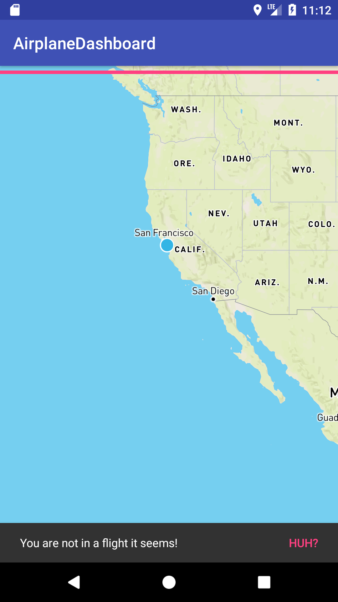

# AirplaneDashboard
monitor your flight in realtime using GPS

## features
- automatically caches world map with basic information (city names, etc) for offline-use
- show information gathered from GPS (altitude, speed, etc)
- shows current location

